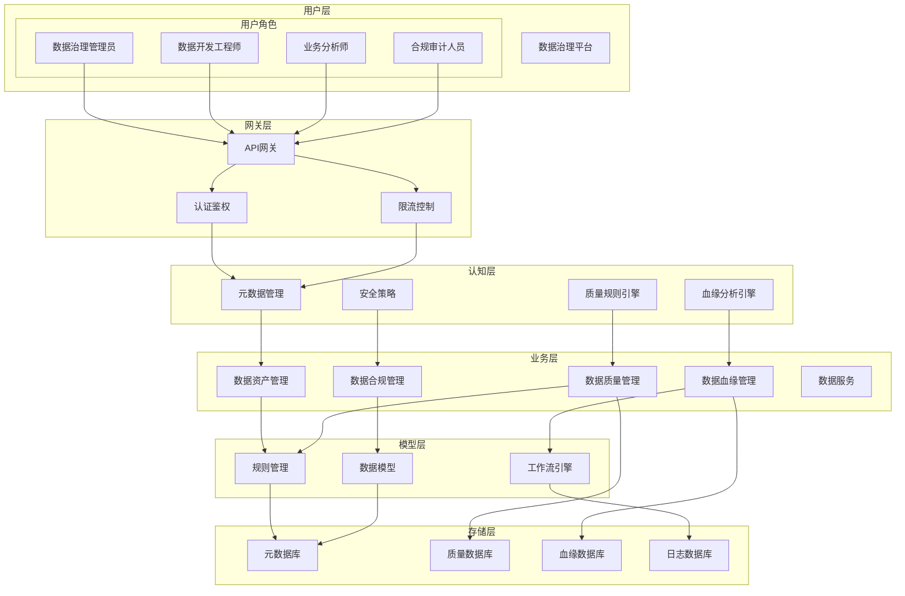
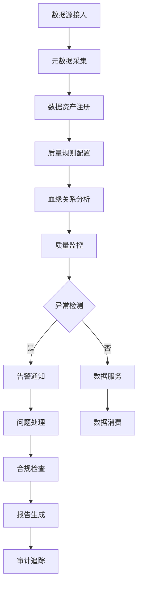
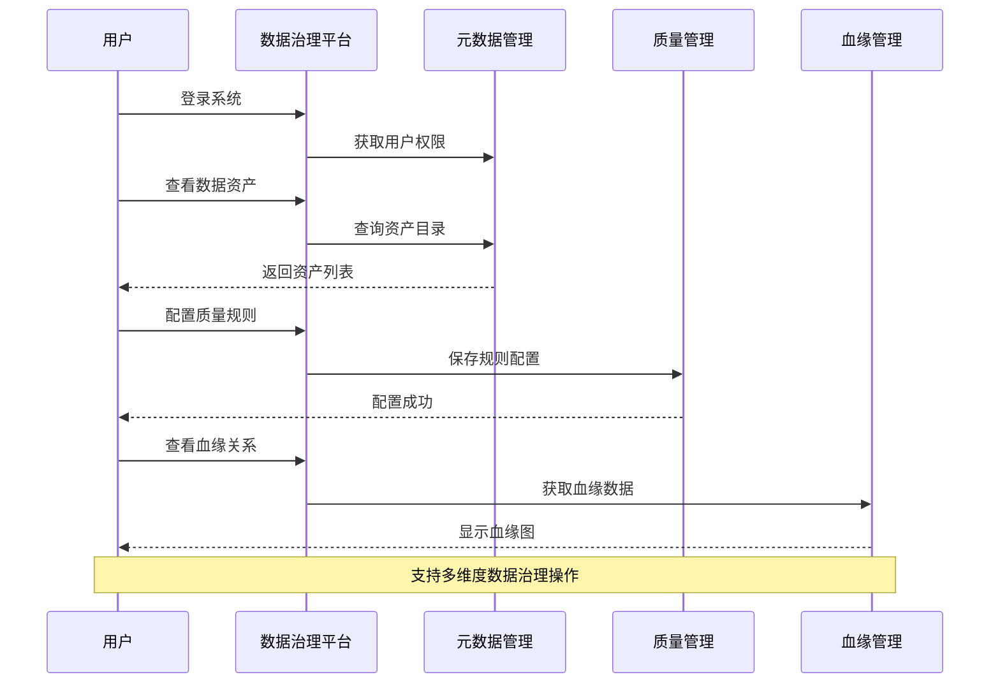

# 数据治理应用 - 产品需求文档

## 📊 PRD生成进度: ████████████████████████████████ 60%

✅ 需求理解 → ✅ 模式选择 → ✅ 模板选择 → ⏳ PRD生成 → ⏳ 后续操作

# 数据治理应用 - 产品需求文档

## 1. 项目信息

| 项目 | 内容 |
|------|------|
| 需求名称 | 数据治理应用 |
| 产品类型 | Web应用（管理系统） |
| 目标用户 | 数据治理团队、IT部门、业务部门 |
| 优先级 | P0 |
| 数据量级 | 10-100TB |

## 2. 需求背景

### 现状痛点
- 数据分散在各个业务系统，缺乏统一管理
- 数据质量参差不齐，影响业务决策
- 数据安全合规风险日益增加
- 数据资产价值无法有效评估和利用

### 业务目标
- 建立企业级数据治理体系
- 提高数据质量和可信度
- 确保数据安全合规
- 释放数据资产价值

### 用户价值
- 数据治理团队：提供统一的管理工具
- IT部门：简化数据管理流程
- 业务部门：获得高质量数据支持

## 3. 需求目标

### 核心目标
- 建立完整的数据资产目录（优先级：P0）
- 实现数据质量监控和预警（优先级：P0）
- 构建数据血缘追踪系统（优先级：P0）

### 次要目标
- 提供合规性报告功能（优先级：P1）
- 支持数据生命周期管理（优先级：P1）
- 提供数据可视化分析（优先级：P2）

### 衡量指标
- 数据质量问题发现率：≥95%
- 数据血缘覆盖率：≥90%
- 系统响应时间：<3秒
- 用户满意度：≥90%

## 4. 需求概述

### 产品定位
企业级数据治理管理平台，提供数据资产、数据质量、数据血缘等核心功能。

### 核心功能
- **数据资产管理**：目录管理、标签分类、版本控制
- **数据质量管理**：质量规则、监控预警、问题跟踪
- **数据血缘分析**：血缘追踪、影响分析、可视化展示
- **权限安全管理**：角色权限、数据脱敏、操作审计

### 用户场景
- 数据治理管理员：配置治理规则、监控整体状态
- 数据开发工程师：查看血缘关系、处理数据质量问题
- 业务分析师：查找可用数据、理解数据含义
- 合规审计人员：生成合规报告、追踪数据使用

## 5. 详细方案

### 5.1 系统架构图（泳道图）

### 5.2 业务流程图

### 5.3 交互流程图（序列图）

### 5.4 核心模块功能详解

| 模块 | 功能点 | 描述 | 优先级 |
|------|--------|------|--------|
| 数据资产管理 | 资产目录 | 统一管理企业数据资产 | P0 |
| 数据资产管理 | 标签分类 | 自定义标签体系 | P1 |
| 数据资产管理 | 版本控制 | 数据版本历史管理 | P1 |
| 数据质量管理 | 质量规则 | 配置数据质量校验规则 | P0 |
| 数据质量管理 | 监控预警 | 实时监控数据质量 | P0 |
| 数据质量管理 | 问题跟踪 | 跟踪处理数据质量问题 | P1 |
| 数据血缘管理 | 血缘追踪 | 追踪数据流转路径 | P0 |
| 数据血缘管理 | 影响分析 | 分析变更影响范围 | P1 |
| 数据安全管理 | 权限控制 | 细粒度权限管理 | P0 |
| 数据安全管理 | 数据脱敏 | 敏感数据脱敏处理 | P1 |

## 6. 异常处理

### 权限异常
- 未授权用户访问：返回403错误
- 越权操作：记录日志并拒绝

### 数据异常
- 数据源连接失败：自动重试机制
- 数据质量规则冲突：提示用户修改规则
- 血缘分析超时：异步处理结果通知

### 系统异常
- 服务不可用：降级处理
- 数据库连接池耗尽：自动扩容
- 高并发访问：限流保护

## 7. 上线计划

### 第一阶段（1-2个月）
- 数据资产管理基础功能
- 基础质量规则配置
- 用户权限管理

### 第二阶段（3-4个月）
- 数据质量监控告警
- 数据血缘追踪功能
- 合规性报告基础

### 第三阶段（5-6个月）
- 高级数据分析功能
- AI辅助治理建议
- 第三方系统集成

## 📊 PRD生成进度: ████████████████████████████████████ 100%

✅ 需求理解 → ✅ 模式选择 → ✅ 模板选择 → ✅ PRD生成 → ⏳ 后续操作

✓ PRD生成完成！

---

您可以进行：
- 📥 导出Markdown
- 📤 导出HTML  
- 👁️ 查看交互原型
- 📚 版本历史
- ✏️ 修改特定章节
- 🔄 继续迭代
- 🆕 新建PRD