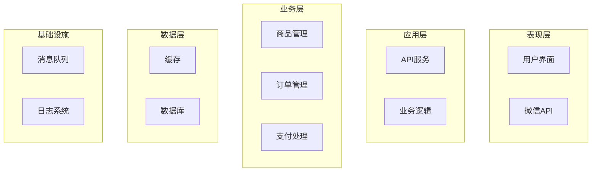
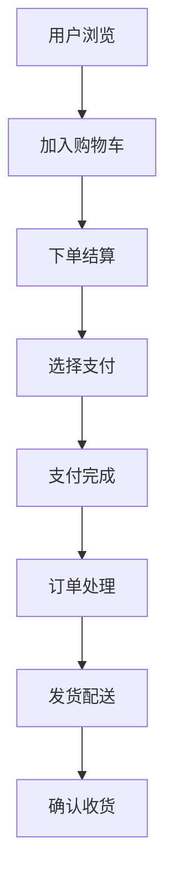
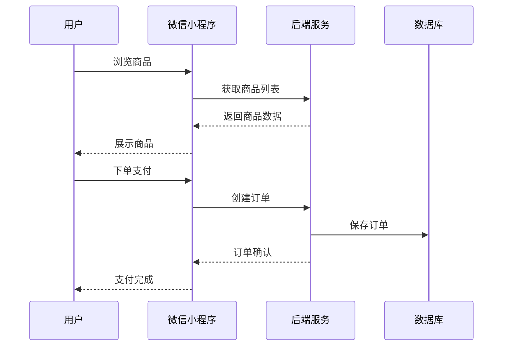

# PRD Generator Skill

## 简介

智能产品需求文档（PRD）生成助手，可以在 Claude Code 中直接使用。

## 功能

- **交互式生成**: 引导式交互，逐步确认需求
- **进度可视化**: 实时显示生成进度和步骤状态
- **智能需求补全**: 根据产品类型自动询问关键信息
- **需求优先级分析**: 基于行业标准自动分析功能优先级
- **内容智能增强**: 自动补充行业背景、最佳实践和风险评估
- **架构图智能生成**: 根据复杂度自动生成合适粒度的架构图
- **多视图支持**: 技术/业务/数据/部署/安全多角度视图
- **质量保证机制**: 自动检查内容完整性和逻辑一致性，提供改进建议
- **模式选择**: 支持市场调研模式 / 直接生成模式
- **多模板**: 完整模板、简洁模板、行业模板
- **版本管理**: 自动保存历史版本
- **导出功能**: 支持Markdown、HTML导出
- **产品原型**: 支持从设计稿或截图生成可编辑HTML原型
- **HTML导入**: 支持上传HTML文件或设计稿图片，智能解析生成可编辑页面
- **实时编辑**: 集成文本编辑器，支持点击编辑、自动保存、撤销/重做
- **交互原型**: 生成可预览的交互原型
- **版本对比**: 查看历史版本差异

## 使用方式

直接告诉它你想做什么产品，例如：

```
帮我做一个电商小程序的PRD
```

系统会自动引导：
1. 需求确认
2. 模式选择（市场调研/直接生成）
3. 方案确认（如果选择市场调研）
4. 模板选择
5. PRD生成
6. 后续操作（导出/修改/新建）
7. 产品原型交互（可选）- 查看或编辑生成的原型

## 交互示例

```
你: 帮我做一个电商小程序

助手: 📊 PRD生成进度: ███████████████████████████ 20%

✅ 需求理解 → ⏳ 模式选择 → ⏳ 模板选择 → ⏳ PRD生成 → ⏳ 后续操作

我理解您的产品需求是：
- 产品名称: 电商小程序
- 产品类型: 微信小程序
- 业务领域: 电商
- 目标用户: 消费者

为了更好地生成PRD，请补充以下信息：

🔍 **智能补全问题**：
- 是否需要商品库存管理？ [✓ 是]
- 是否需要积分/优惠券系统？ [✓ 是]
- 是否需要商家入驻功能？ [✗ 否]
- 预计日订单量级？ [1000-5000]

💡 **优先级分析**：
根据行业经验，建议的优先级：
- P0: 商品浏览、购物车、支付流程、订单管理
- P1: 用户评价、推荐系统、优惠券功能
- P2: 社交分享、直播带货、预售功能

📈 **行业洞察**：
电商行业趋势：
- 移动端交易占比已达80%
- 社交电商年增长率35%
- 直播带货成为新的增长点
- 用户体验是核心竞争因素

请问需要哪种方式生成PRD？
A. 市场调研模式
B. 直接生成模式

你: B

助手: 📊 PRD生成进度: █████████████████████████████ 40%

✅ 需求理解 → ✅ 模式选择 → ⏳ 模板选择 → ⏳ PRD生成 → ⏳ 后续操作

请选择PRD模板：
1. 完整模板
2. 简洁模板
...

你: 1

助手: 📊 PRD生成进度: ████████████████████████████████████ 100%

✅ 需求理解 → ✅ 模式选择 → ✅ 模板选择 → ✅ PRD生成 → ⏳ 后续操作

✓ PRD已生成完成！

## 1. 项目信息
**需求名称**: 电商小程序
**产品类型**: 微信小程序
**目标用户**: 消费者
**优先级**: P0
**复杂度**: 中等（8个核心功能）

## 5. 详细方案
### 5.1 系统架构图（智能5层架构）
基于8个核心功能的复杂度评估，自动生成5层架构图：



### 5.2 业务流程图（智能简化版）
自动识别核心流程，保留8个关键步骤：



### 5.3 交互流程图（多角色视图）
支持多角色交互，包含用户、小程序、后端、数据库：



## 2. 需求背景
### 行业背景分析
电商行业正处于高速发展期，根据艾瑞咨询数据，2023年中国电商市场规模达13.8万亿元，同比增长8.5%。移动端购物已成为主流，占比超过80%。
...
```

## 后续操作

PRD生成后，可以：
- 导出Markdown / 导出HTML
- 查看原型
- 导入设计稿 - 上传HTML文件或图片生成可编辑原型
- 版本历史 / 版本对比
- 修改章节（根据质量建议优化）
- 继续迭代 / 新建PRD

### 原型功能特色

**产品原型生成**：
- 根据PRD描述自动生成基础原型
- 支持从设计稿图片生成可编辑页面
- 点击任意文字即可编辑
- 自动保存编辑内容
- 支持撤销/重做操作

**HTML导入功能**：
- 支持HTML文件直接解析
- 支持设计稿图片上传
- Claude智能分析图片布局和内容
- 生成结构化的可编辑HTML
- 保留原有样式和布局

### 质量保证示例
```
📋 质量保证报告
评分：92分（优秀）

完整性检查：✅
- [x] 所有必填章节已包含
- [x] 核心功能点已覆盖
- [x] 优先级已明确标注

改进建议：
1. 建议增加数据安全章节
2. 优化上线计划，增加灰度发布
3. 补充高并发性能考虑
```