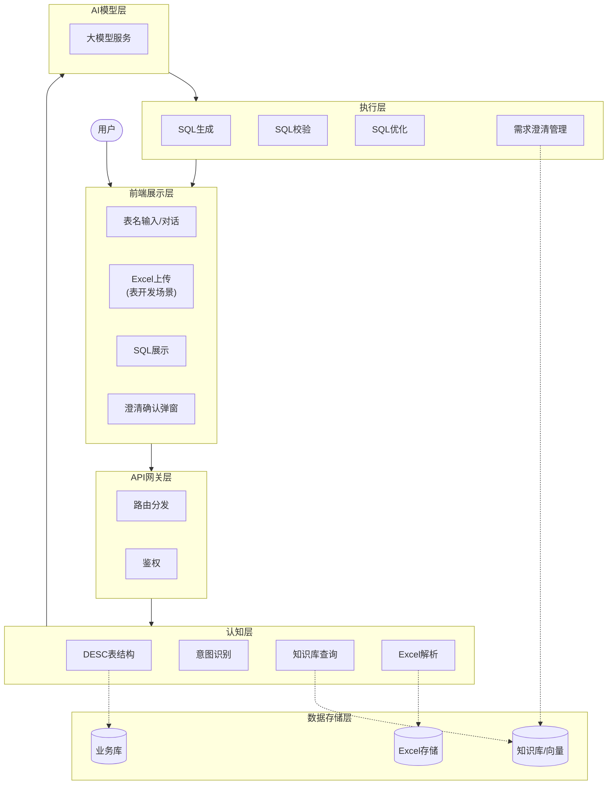
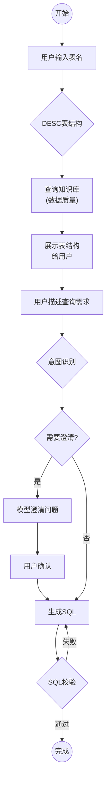
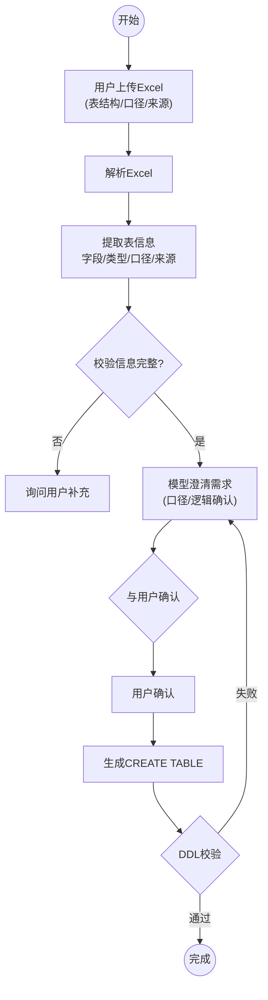
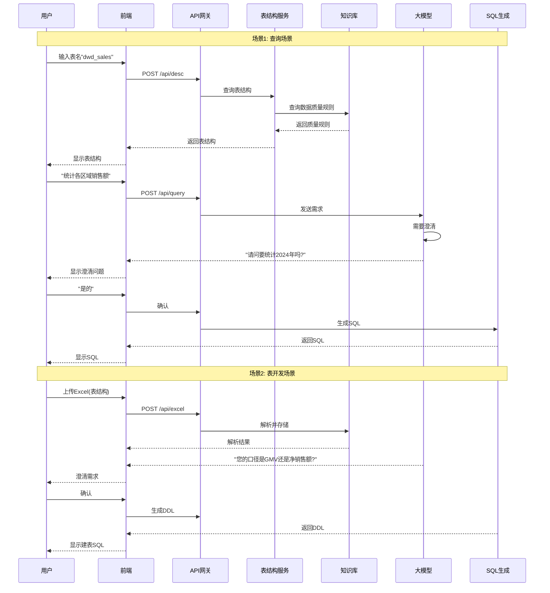

# Spark SQL智能生成器 - 产品需求文档 v3.0

## 1. 项目信息

| 项目 | 内容 |
|------|------|
| 需求名称 | Spark SQL智能生成器 |
| 产品类型 | Web应用（内部工具） |
| 目标用户 | 数据开发工程师、BI分析师 |
| 优先级 | P0 |

## 2. 需求背景

### 现状痛点
- 业务人员依赖开发人员编写SQL，沟通成本高
- 需求描述与实现之间存在信息损耗
- SQL编写排期影响业务数据分析进度

### 业务目标
- 降低SQL获取门槛，提升数据获取效率
- 实现业务人员自助生成SQL
- 释放开发人员专注复杂任务

## 3. 需求目标

### 核心目标
- 通过表名输入/DESC查询生成可用的Spark SQL
- 支持知识库查询进行数据质量保障
- 支持表结构开发场景的Excel导入

### 次要目标
- 提供SQL性能优化建议
- 支持需求澄清交互
- 提供历史记录和复用功能

### 衡量指标
- SQL生成准确率 > 90%
- 用户满意度 > 4.5分
- 平均生成时间 < 10秒

## 4. 需求概述

### 产品定位
面向业务人员的SQL生成工具，通过简单直观的交互方式，让非技术人员也能快速获取所需的数据查询SQL。

### 核心功能
1. **表名查询** - 输入表名，DESC/知识库查询表结构
2. **知识库查询** - 数据质量保障和清洗
3. **SQL生成** - Spark SELECT语句
4. **需求澄清** - 与用户确认需求后再生成SQL
5. **SQL优化** - 性能建议、写法改进

### 用户场景（重要）

#### 场景1：查询场景 - 业务人员查询数据
用户输入表名 → 系统DESC表结构/查询知识库 → 用户描述查询需求 → 模型澄清确认 → 生成SQL

- 用户输入："dwd_sales_detail"
- 系统展示表结构desc结果
- 用户输入："帮我统计各区域销售额"
- 模型澄清："请问您是要统计2024年的销售额吗？"
- 用户确认后生成SQL

#### 场景2：表开发场景 - 开发人员创建新表
用户上传Excel（表结构、取数口径、来源表）→ 模型解读并澄清需求 → 确认后生成建表SQL

- 用户上传Excel：包含字段名、类型、描述、口径、来源表
- 模型解析Excel，识别表结构
- 模型澄清："您说的'销售额'是指GMV还是净销售额？"
- 用户确认后生成CREATE TABLE语句

#### 场景3：优化场景 - 开发人员优化SQL
用户输入SQL → 系统分析 → 提供优化建议

## 5. 详细方案

### 5.1 系统架构全景图（泳道图）

### 5.2 业务流程图 - 查询场景

### 5.3 业务流程图 - 表开发场景

### 5.4 交互流程图（序列图）

### 5.5 核心模块功能详解

#### 模块1：表结构服务

| 功能 | 说明 |
|------|------|
| DESC表结构 | 查询Hive/Spark表的字段信息 |
| 知识库查询 | 查询数据质量规则、口径说明 |
| 数据预览 | 支持预览表数据样本 |

#### 模块2：意图识别与澄清

| 功能 | 说明 |
|------|------|
| 意图识别 | 判断生成/优化/解释SQL |
| 需求澄清 | 关键问题与用户确认 |
| 上下文记忆 | 多轮对话上下文 |

#### 模块3：Excel解析（表开发）

| 功能 | 说明 |
|------|------|
| 字段解析 | 提取字段名、类型、描述 |
| 口径提取 | 提取计算口径说明 |
| 来源表提取 | 提取来源表信息 |
| 模板校验 | 校验Excel格式 |

#### 模块4：SQL生成引擎

| 功能 | 说明 |
|------|------|
| SELECT生成 | 支持单表/多表JOIN |
| 聚合函数 | SUM/COUNT/AVG/MAX/MIN |
| 窗口函数 | 支持OVER/PARTITION BY |
| DDL生成 | 生成CREATE TABLE语句 |

### 5.6 表开发场景 - Excel模板规范

| 字段 | 说明 | 示例 |
|------|------|------|
| table_name | 表名 | dwd_sales_detail |
| column_name | 字段名 | sale_amount |
| column_type | 字段类型 | decimal(18,2) |
| description | 字段描述 | 销售金额 |
| calc_logic | 取数口径 | GMV - 退款金额 |
| source_table | 来源表 | ods_order |
| source_column | 来源字段 | order_amount |
| etl_rule | ETL规则 | 按天分区 |

## 6. 异常处理

| 场景 | 处理方式 |
|------|----------|
| 表名不存在 | 提示用户检查表名，支持模糊搜索 |
| 知识库无数据 | 提示用户补充口径说明 |
| Excel格式错误 | 提示具体错误位置 |
| SQL生成失败 | 返回错误原因，支持重试 |
| 模型超时 | 30秒超时提示 |
| 意图不明确 | 引导用户补充说明 |

## 7. 上线计划

| 阶段 | 时间 | 内容 |
|------|------|------|
| MVP | 2周 | 表名查询 + DESC + SQL生成 |
| V1.1 | 1周 | 需求澄清交互 |
| V1.2 | 1周 | 表开发场景(Excel导入) |
| V2.0 | 2周 | 知识库完善 + 优化建议 |

---

*文档版本：v3.0*
*创建日期：2026-04-02*
