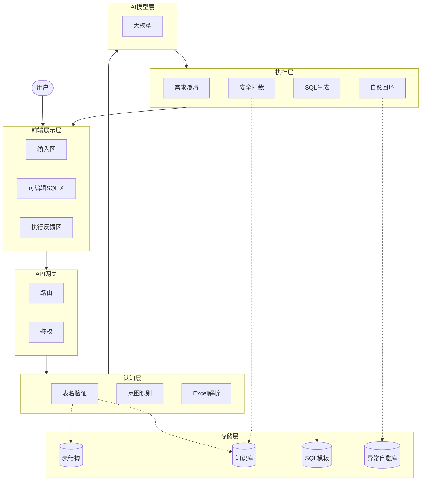
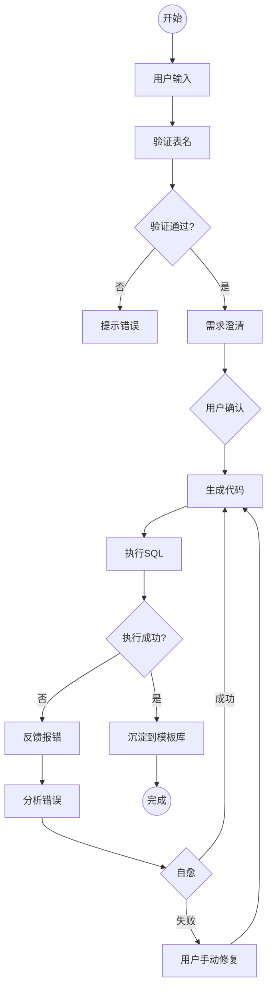
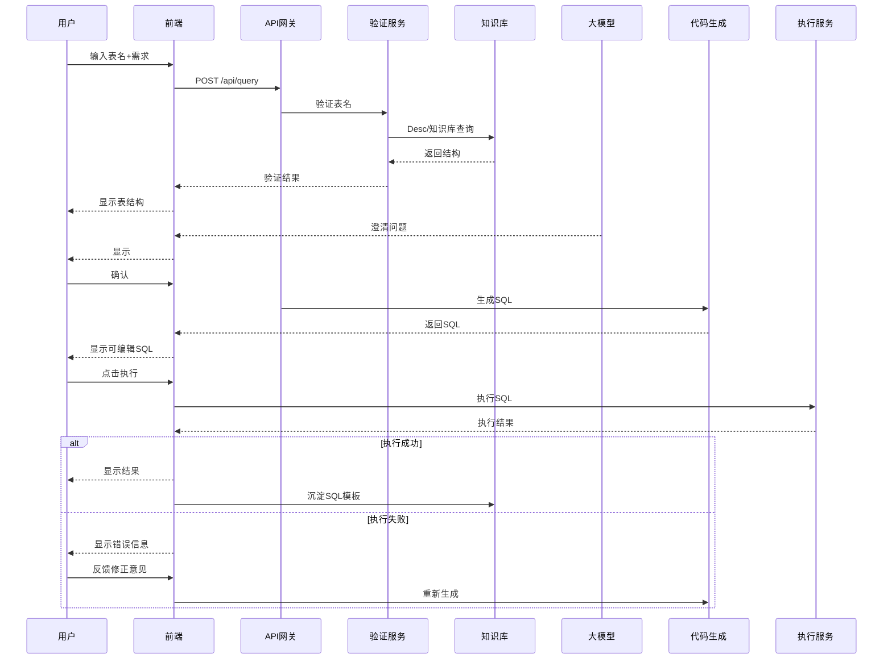

# Spark SQL智能生成器 - 产品需求文档 v5.0

## 1. 项目信息

| 项目 | 内容 |
|------|------|
| 需求名称 | Spark SQL智能生成器 |
| 产品类型 | Web应用（内部工具） |
| 目标用户 | 数据开发工程师、BI分析师 |
| 优先级 | P0 |

## 2. 需求目标

- 用户输入表名+需求描述 → 验证表名 → 需求澄清 → 生成SQL
- 用户选择表开发 → 上传Excel+描述 → 需求澄清 → 生成DDL
- **SQL执行错误反馈机制**
- **SQL模板库（异步沉淀）**
- **安全拦截机制**
- **异常自愈库（Case Base）**

## 3. 用户场景

### 场景1：查询模式
输入表名+需求描述 → 验证表名 → 澄清需求 → 确认 → 生成SQL → 执行反馈

### 场景2：表开发模式
上传Excel+描述 → 解析验证 → 澄清需求 → 确认 → 生成DDL → 执行反馈

### 场景3：SQL优化
输入SQL → 优化建议

## 4. 详细方案

### 4.1 系统架构全景图

### 4.2 业务流程图（含反馈）

### 4.3 交互流程图（含错误反馈）

### 4.4 安全拦截机制

| 拦截类型 | 说明 |
|----------|------|
| SQL注入检测 | 检测恶意SQL关键字 |
| 越权字段检测 | 禁止访问敏感字段 |
| 隐私保护规则 | 自动脱敏敏感数据 |
| 大查询限制 | 限制全表扫描 |
| 危险操作拦截 | DROP/DELETE/TRUNCATE |

### 4.5 SQL模板库（异步沉淀）

| 字段 | 说明 |
|------|------|
| 模板名称 | 模板标识名 |
| SQL模板 | SQL语句模板 |
| 适用场景 | 使用场景描述 |
| 创建时间 | 入库时间 |

- 执行成功后异步入库
- 模板分类：聚合、排序、窗口函数、JOIN等
- 生成SQL时匹配相似模板

### 4.6 异常自愈库（Case Base）

| 字段 | 说明 |
|------|------|
| 错误类型 | 错误分类 |
| 错误信息 | 原始报错 |
| 修复方案 | 修复代码 |
| 修复次数 | 成功修复次数 |

- 错误分析：分析SQL错误
- Case匹配：匹配自愈库
- 自动修复：修正后重试(1次)
- 成功案例沉淀

### 4.7 核心模块功能

| 模块 | 功能 | 说明 |
|------|------|------|
| 表名验证服务 | Desc查询 | 查询Hive/Spark表结构 |
| 表名验证服务 | 知识库验证 | 数据质量规则 |
| 表名验证服务 | 安全拦截 | 权限/敏感字段 |
| 需求澄清管理 | 意图分析 | 理解需求 |
| 需求澄清管理 | 问题生成 | 生成澄清问题 |
| 需求澄清管理 | 确认管理 | 等待确认 |
| 自愈回环 | 错误分析 | 分析SQL错误 |
| 自愈回环 | Case匹配 | 匹配自愈库 |
| 自愈回环 | 自动修复 | 修正后重试 |

## 5. 异常处理

| 场景 | 处理 |
|------|------|
| 表名不存在 | 提示错误+模糊搜索 |
| SQL执行失败 | 反馈报错+自愈重试 |
| 安全拦截 | 拦截+提示原因 |
| 自愈失败 | 用户手动修复 |
| Excel格式错误 | 提示修正位置 |

## 6. 上线计划

| 阶段 | 时间 | 内容 |
|------|------|------|
| MVP | 2周 | 表名验证+SQL生成+执行反馈 |
| V1.1 | 1周 | 需求澄清+安全拦截 |
| V1.2 | 1周 | 表开发场景+模板库 |
| V2.0 | 2周 | 自愈库+完整功能 |

---

*文档版本：v5.0*
*创建日期：2026-04-02*
