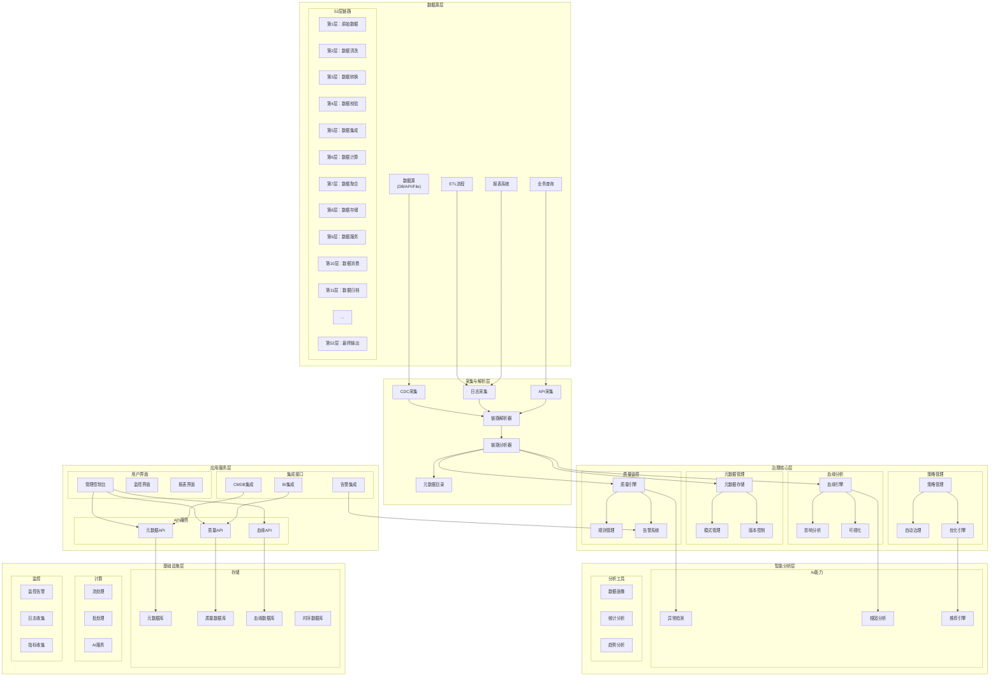
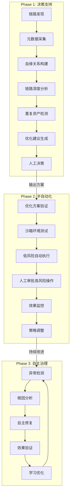
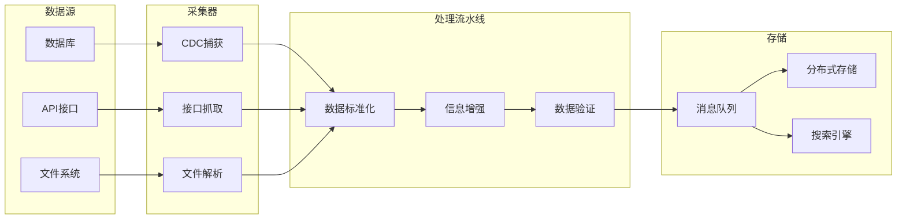
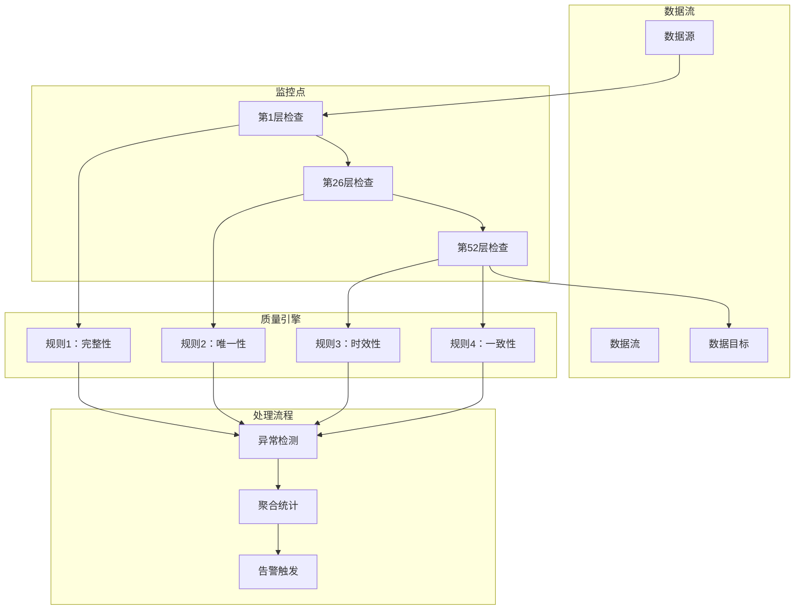

# 数据治理Agent - 产品需求文档

## 📊 PRD生成进度: ███████████████████████████ 20%

✅ 需求理解 → ⏳ 模式选择 → ⏳ 模板选择 → ⏳ PRD生成 → ⏳ 后续操作

## 1. 项目信息

| 项目 | 内容 |
|------|------|
| 需求名称 | 数据治理Agent |
| 产品类型 | 智能治理系统 |
| 目标用户 | 数据治理团队、数据工程师、业务分析师 |
| 优先级 | P0 |
| 数据链路 | 52层加工链路（Spark + DolphinScheduler） |
| 数据量级 | 1万+ ETL任务 |
| 技术栈 | Spark、DolphinScheduler、血缘分析系统 |
| 实施策略 | 渐进式演进（A→B→C方案） |

## 2. 需求背景

### 现状痛点
- **链路过长**：52层数据加工链路，影响效率和维护成本
- **血缘复杂**：难以追踪数据流转路径和影响范围
- **质量参差不齐**：各环节数据质量标准不统一
- **变更困难**：单点变更可能影响整条链路
- **合规风险**：缺乏有效的监控和审计机制
- **维护成本高**：人工治理效率低下，成本高昂

### 业务目标
#### 阶段目标（渐进式实施）
**Phase 1 (A方案 - 决策支持)**：
- **建立血缘分析体系**：完整解析52层链路关系
- **提供优化建议**：识别冗余链路和重复计算
- **人工决策支持**：提供成本效益分析和风险评估
- **目标**：治理效率提升50%

**Phase 2 (B方案 - 半自动化)**：
- **沙箱环境测试**：在隔离环境中验证优化方案
- **低风险自动执行**：简单优化自动实施
- **人工审批机制**：高风险操作需人工确认
- **目标**：治理效率提升80%

**Phase 3 (C方案 - 自主治理)**：
- **自愈式治理**：系统自主识别并修复问题
- **预测性维护**：提前预警链路风险
- **自适应优化**：基于历史数据持续优化链路
- **目标**：治理效率提升95%

### 用户价值
- **数据治理团队**：提供统一的治理平台和工具
- **数据工程师**：简化链路维护和问题排查
- **业务分析师**：获得高质量数据支持决策
- **合规审计**：提供完整的审计追踪和报告

## 3. 需求目标

### 核心目标（P0 - Phase 1）
- **元数据自动采集**：覆盖52层链路的完整元数据（2周内）
- **血缘关系追踪**：实现端到端的数据血缘分析（2周内）
- **链路深度分析**：识别>10层的不合理链路（1个月内）
- **重复资产检测**：自动发现重复计算和冗余节点（1个月内）
- **优化建议生成**：提供具体的重构方案和成本效益分析（1.5个月内）

### 次要目标（P1）
- **影响分析系统**：变更影响范围快速识别（2个月内）
- **优化建议引擎**：提供链路优化建议（3个月内）
- **合规性报告**：自动生成各类合规报告（2个月）
- **AI辅助治理**：基于机器学习的智能优化（6个月）

### 衡量指标
- 数据血缘覆盖率：100%（52层全链路）
- 质量问题发现时效：<5分钟
- 系统响应时间：<3秒
- 人工干预率：<20%
- 治理效果提升：≥80%

## 4. 需求概述

### 产品定位
专为超复杂数据链路设计的数据治理Agent，提供从元数据管理到智能优化的全链路治理能力。

### 核心功能

#### 🎯 核心治理能力
- **链路解析引擎**：自动解析52层数据加工流程
- **血缘追踪系统**：端到端的数据血缘关系管理
- **质量监控中心**：实时质量监控和智能告警
- **策略管理器**：灵活配置治理规则和策略
- **影响分析器**：快速识别变更影响范围
- **优化建议引擎**：提供链路优化建议

#### 🛠️ 技术特色功能
- **智能元数据发现**：自动识别和分类数据资产
- **异常检测算法**：基于机器学习的异常识别
- **根因分析**：快速定位数据质量问题源头
- **自动化修复**：80%常见问题自动修复
- **可视化控制台**：直观展示治理状态和效果

### 用户场景

#### 场景1：数据链路治理
- **数据治理管理员**：配置治理策略、监控整体状态
- **数据工程师**：处理数据质量问题、优化链路性能
- **业务分析师**：理解数据来源、评估数据质量

#### 场景2：变更管理
- **变更发起人**：提交变更申请、评估影响范围
- **变更审批人**：查看影响分析、做出审批决策
- **运维人员**：执行变更、监控效果

#### 场景3：质量监控
- **监控人员**：查看实时质量指标
- **问题处理**：接收告警、处理问题
- **报告生成**：生成质量分析报告

## 5. 详细方案

### 5.1 系统架构图



### 5.2 数据链路血缘图

```mermaid
flowchart TD
    subgraph "数据源层"
        A[原始数据源<br>DB/API/文件]
        B[外部数据<br>第三方API]
        C[实时数据流<br>Kafka消息]
    end
    
    subgraph "52层加工链路"
        D1[第1层：数据采集<br>初始数据接入]
        D2[第2层：数据清洗<br>去除重复数据]
        D3[第3层：格式转换<br>标准化处理]
        D4[第4层：数据验证<br>业务规则校验]
        D5[第5层：数据关联<br>多源数据整合]
        D6[第6层：数据计算<br>业务指标计算]
        D7[第7层：数据聚合<br>汇总统计]
        D8[第8层：数据缓存<br>性能优化]
        D9[第9层：数据分发<br>多路由输出]
        D10[第10层：数据服务<br>API服务]
        D11[第11层：数据同步<br>跨系统同步]
        D12[第12层：数据备份<br>容灾备份]
        D13["...第13-51层..."]
        D52[第52层：最终输出<br>业务数据]
    end
    
    subgraph "消费层"
        E[BI报表系统]
        F[实时大屏]
        G[业务应用]
        H[下游系统]
    end
    
    %% 血缘关系
    A --> D1
    B --> D1
    C --> D1
    
    D1 --> D2
    D2 --> D3
    D3 --> D4
    D4 --> D5
    D5 --> D6
    D6 --> D7
    D7 --> D8
    D8 --> D9
    D9 --> D10
    D10 --> D11
    D11 --> D12
    D12 --> D13
    D13 --> D52
    
    D52 --> E
    D52 --> F
    D52 --> G
    D52 --> H
    
    %% 标注关键节点
    style D1 fill:#f9f,stroke:#333,stroke-width:2px
    style D26 fill:#f9f,stroke:#333,stroke-width:2px  %% 中间节点
    style D52 fill:#f9f,stroke:#333,stroke-width:2px
```

### 5.3 渐进式治理流程图



### 5.4 核心模块功能详解（渐进式实施）

#### Phase 1 决策支持系统
| 模块 | 功能点 | 描述 | 优先级 | 技术实现 |
|------|--------|------|--------|----------|
| **血缘分析** | 链路发现 | 自动发现52层数据链路 | P0 | Spark作业解析 |
| **血缘分析** | 血缘追踪 | 端到端血缘关系构建 | P0 | 图数据库+Neo4j |
| **血缘分析** | 深度分析 | 识别>10层的不合理链路 | P0 | 图算法分析 |
| **血缘分析** | 影响分析 | 变更影响范围评估 | P0 | 依赖图分析 |
| **优化分析** | 重复检测 | 自动发现重复计算 | P0 | 相似度算法 |
| **优化分析** | 瓶颈定位 | 识别性能瓶颈节点 | P1 | 时序数据分析 |
| **优化分析** | 建议生成 | 提供重构方案和成本分析 | P0 | AI推荐引擎 |
| **决策支持** | 方案对比 | 多方案可行性分析 | P1 | 决策树模型 |
| **决策支持** | 风险评估 | 变更风险评估矩阵 | P1 | 风险量化模型 |

#### Phase 2 半自动化治理
| 模块 | 功能点 | 描述 | 优先级 | 技术实现 |
|------|--------|------|--------|----------|
| **沙箱环境** | 环境隔离 | 创建测试验证环境 | P0 | Docker容器化 |
| **沙箱环境** | 方案验证 | 在安全环境测试优化方案 | P1 | 自动化测试 |
| **自动执行** | 低风险操作 | 自动执行简单优化 | P1 | 任务调度引擎 |
| **自动执行** | 回滚机制 | 一键回滚失败操作 | P0 | 版本控制系统 |
| **审批流程** | 人工审批 | 高风险操作人工确认 | P0 | 工作流引擎 |
| **监控告警** | 效果监控 | 实时监控优化效果 | P1 | 监控系统 |
| **监控告警** | 异常告警 | 告警通知和问题定位 | P1 | 告警系统 |

#### Phase 3 自主治理
| 模块 | 功能点 | 描述 | 优先级 | 技术实现 |
|------|--------|------|--------|----------|
| **智能分析** | 预测分析 | 预测链路潜在风险 | P2 | 机器学习模型 |
| **智能分析** | 根因分析 | 自动定位问题根因 | P2 | 因果推理 |
| **自主执行** | 自愈修复 | 系统自主修复问题 | P2 | 自主Agent |
| **自主执行** | 自适应优化 | 基于历史数据持续优化 | P2 | 强化学习 |
| **学习机制** | 模型迭代 | 从历史中学习优化 | P2 | 深度学习 |

### 5.5 技术实现方案

#### 1. 元数据采集架构


#### 2. 质量监控架构


## 6. 风险管理与安全控制

### Phase 1 安全措施
- **权限控制**：Agent只有只读权限，不执行任何修改
- **人工审批**：所有优化方案都需要人工确认
- **影响分析**：详细的变更影响评估报告
- **回滚准备**：每个方案都有明确的回滚路径

### Phase 2 安全机制
- **沙箱隔离**：所有优化先在沙箱环境验证
- **分级执行**：
  - L1级（低风险）：可自动执行
  - L2级（中风险）：需要部门负责人审批
  - L3级（高风险）：需要数据治理委员会审批
- **监控告警**：实时监控执行效果，异常立即告警
- **紧急熔断**：一键暂停所有Agent活动

### Phase 3 安全保障
- **自主约束**：Agent内置安全策略，不会执行危险操作
- **学习边界**：Agent只能在预设规则范围内学习和优化
- **审计追踪**：完整记录所有决策和执行过程
- **人工否决**：任何时候都可以否决Agent的决策

### 异常处理策略
- **数据异常**：
  - 链路中断：自动重试+路由切换
  - 数据错误：标记并通知，不自动修复
  - 血缘异常：重新构建并验证
  
- **系统异常**：
  - 服务故障：降级处理，保证核心功能
  - 资源不足：资源优先分配给关键模块
  - 网络问题：本地缓存，异步恢复
  
- **业务异常**：
  - 规则冲突：基于优先级和人工判断
  - 误报处理：快速响应和修正规则
  - 效果不佳：立即回滚并重新分析

## 7. 上线计划

### 第一阶段（MVP版本 - 4周）
- **核心能力**
  - 链路自动发现和元数据采集
  - 基础血缘关系追踪
  - 简单的质量规则配置
  - 基础Web控制台

- **交付物**
  - 链路发现工具
  - 元数据管理界面
  - 血缘关系查看器
  - 基础质量规则配置

### 第二阶段（完整版 - 8周）
- **新增能力**
  - 实时质量监控
  - 智能告警系统
  - 影响分析功能
  - 自动化修复能力
  - 高级可视化功能

- **交付物**
  - 实时监控仪表板
  - 智能告警系统
  - 影响分析工具
  - 自动修复引擎

### 第三阶段（AI增强版 - 12周）
- **新增能力**
  - AI辅助根因分析
  - 智能优化建议
  - 预测性维护
  - 高级分析能力

- **交付物**
  - AI分析引擎
  - 智能优化系统
  - 预测分析平台
  - 高级分析工具

## 8. 治理策略

### 1. 分层治理策略
- **L1基础治理**：数据接入和标准
- **L2过程治理**：加工过程监控
- **L3结果治理**：输出质量保障
- **L4持续治理**：优化和改进

### 2. 质量规则配置
```yaml
# 质量规则示例
rules:
  completeness:
    - source: "*"
      field: "*"
      rule: "not_null"
      threshold: 99.9%
  
  uniqueness:
    - source: "order_table"
      field: "order_id"
      rule: "unique"
      threshold: 100%
  
  timeliness:
    - source: "transaction"
      field: "create_time"
      rule: "within_24h"
      threshold: 95%
  
  consistency:
    - source: "customer_profile"
      field: "email"
      rule: "format_validation"
      threshold: 99%
```

### 3. 告警策略
- **严重级别（P0）**：立即告警，15分钟内响应
- **重要级别（P1）**：30分钟内告警，1小时内响应
- **一般级别（P2）**：2小时告警，4小时内响应

## 📊 PRD生成进度: ████████████████████████████████ 100%

✅ 需求理解 → ✅ 模式选择 → ✅ 模板选择 → ✅ PRD生成 → ✅ 后续操作

✓ 数据治理Agent PRD生成完成！

---

您现在可以：
1. 📄 查看详细文档
2. 🎨 查看系统架构图
3. 📊 查看治理流程图
4. ✏️ 修改特定章节
5. 💾 保存到样本库
6. 🔄 继续迭代优化
7. 🚀 开始实施项目